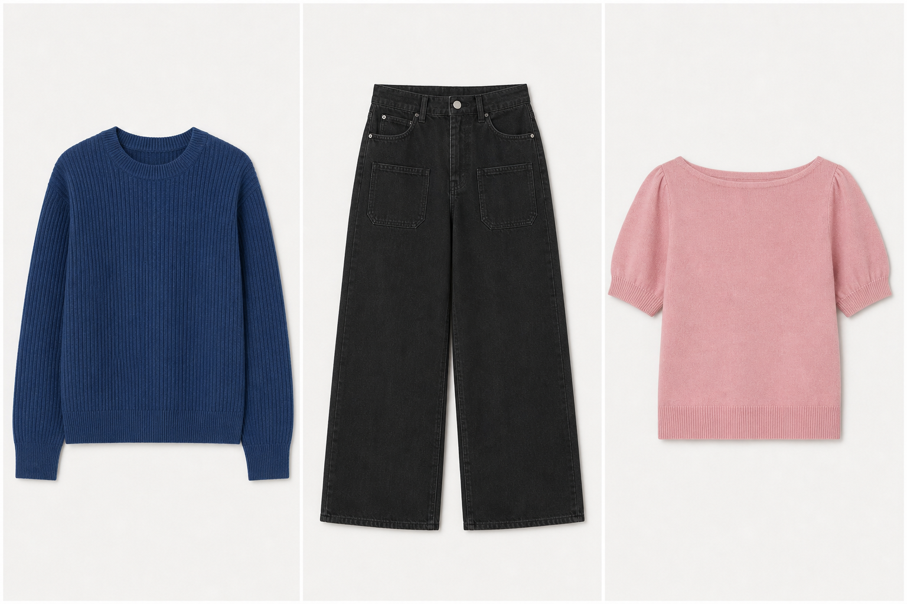

# Merchmix Technical Assignment

**Candidate:** Upashana Dutta  
**Role:** Data Scientist

## Overview

This repository contains my submission for the Merchmix Data Scientist Technical Assignment.

The project combines four-week sales forecasting with an agent-based generative AI workflow. The forecasting stage identifies three promising existing style-colour groups, and the generative stage creates one new garment concept inspired by each selected source style.

## Solution Summary

The submission includes:

- Four-week sales forecasting for existing style-colour groups
- Chronological training, validation, and held-out test evaluation
- Evidence-based selection of three source styles
- An orchestrating agent and specialist sub-agents
- MCP-compatible evidence-retrieval tools
- A reusable fashion-design skill
- Human approval checkpoints
- Numerical and visual validation
- Automated tests and recorded execution evidence
- One final concept board showing three generated products

## Key Results

- **Eligible final candidates:** 32,553 style-colour groups
- **Selected model:** CatBoost, chosen using validation MAE
- **Held-out test MAE:** 15.2722
- **Naive baseline test MAE:** 24.6964
- **MAE reduction versus baseline:** 38.2%
- **Selected source articles:** `0673677002`, `0865799006`, and `0915529001`

The final concepts are:

1. A blue ribbed crew-neck sweater
2. Black wide-leg trousers with patch pockets
3. A pink boat-neck, short-sleeve knit top

## Start Here

- [Technical assignment report](Upashana_Dutta_Merchmix_Technical_Report.pdf)
- [Executed forecasting notebook](merchmixforecasting.ipynb)
- [Final concept board](run_002_source_review/final_concept_board.png)
- [Agent workflow](merchmix/workflow_v2.py)
- [MCP server](merchmix/mcp_server.py)
- [MCP client](merchmix/mcp_client.py)
- [Reusable design skill](skills/evidence-led-fashion-concepts/SKILL.md)
- [Detailed workflow record](run_002_source_review/SUBMISSION_REPORT.md)
- [Source evidence review](run_002_source_review/SOURCE_REVIEW.md)

## Final Concept Board



## Data and Reproducibility

The forecasting notebook uses the H&M Personalized Fashion Recommendations dataset:

- `transactions_train.csv`
- `articles.csv`
- Matching catalogue images

The raw H&M dataset is not included in this repository. The notebook is configured to run in Kaggle after attaching the H&M dataset.

Install the dependencies using:

```bash
pip install -r requirements-forecasting.txt
pip install -r requirements.txt
```

Run the automated tests from the repository root using:

```bash
pytest -q
```

The repository also includes saved workflow outputs, approval records, execution traces, and verification results so that the completed run can be reviewed without rerunning the generative stages.

## Important Limitations

- The forecast values apply to the existing source styles, not the newly generated concepts.
- Reliable stock-on-hand history is unavailable, so the model forecasts observed sales rather than unconstrained demand.
- The winner-ranking weights are business heuristics, not validated success probabilities.
- Historical performance of the source styles does not prove that the generated concepts will perform similarly.
- Future demand and manufacturing feasibility for the new concepts were not evaluated. 
